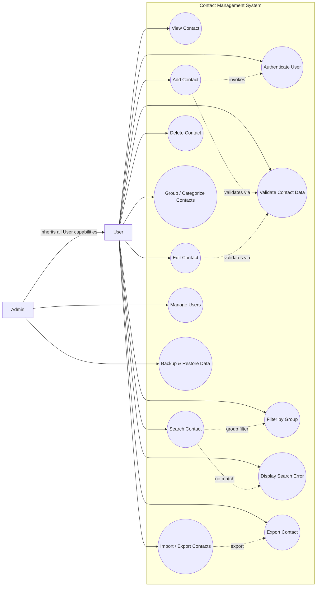

# Contact Management System — Use Case Specification

## 1. Use-Case Diagram

## 1.1 List of Actors

| STT | Actor | Meaning |
|---:|---|---|
| 1 | User | Regular system user who manages personal contacts in the phone book |
| 2 | Admin | System Aministrator who inherits all user capabilities and manages system users/backups |

## 1.2 List of Use-Cases

| STT | Use-case | Meaning | Notes (Groups) |
|---:|---|---|---|
| 1 | Authenticate User | Verifies user login credentials before granting access to secured features | 1(Authentication) |
| 2 | Validate Contact Data | Checks the correctness and format contact inputs (phone,email) | 1 |
| 3 | Filter by Group | Filters and displays contacts based on a selected group / category | 2 |
| 4 | Display Search Error | Displays an alert message when no matching contact is found during a search | 1 |
| 5 | Export Contact | Exports saved contacts to external file formats (e.g., CSV, VCF) | 3 |
| 6 | View Contact | Displays the full list of saved contacts | 2(Contact Management) |
| 7 | Add Contact | Creates and saves a new contact into the phone book | 2 |
| 8 | Edit Contact | Updates existing contact details | 2 |
| 9 | Search Contact | Searches for specific contacts by name, phone number, or email | 2 |
| 10 | Delete Contact | Removes a contact record from the system | 2 |
| 11 | Group / Categorize Contacts | Organizes contacts into specific categories (e.g., Family, Work, Friends) | 2 |
| 12 | Import / Export Contacts | Handles bulk data transactions for contacts | 3(Data Exchange) |
| 13 | Manage Users | Admin capability to create, update, or deactivate system accounts | 4(System Administration) |
| 14 | Backup & Restore Data | Admin capability to create database backups and restore system state | 4 |

## 2. Use-Case Specifications

### Use-case Validate Contact Data

#### Summary

This use-case checks the correctness and format of contact details (such as phone numbers and email syntax) before saving.

#### Event flow

#### Main Event Stream

This use-case is triggered during contact creation or modification.

The system receives input contact data submitted by the user.

The system checks if required fields (e.g., Name, Phone Number) are filled.

The system validates the syntax of the phone number and email address.

The system returns a validation success result to the calling use-case.

Other Event Streams

Invalid Data: If mandatory fields are missing or formats are invalid, the system halts processing and returns error flags.

#### Special requirements

_Without._

#### System status before starting Use-Case implementation

Contact details have been entered and submitted by the user.

#### System status after Use-Case implementation

Contact data is validated and verified as correct.

#### Extension Points

_Without._

### Use-Case Filter by Group

#### Summary

This use-case allows users to filter and display contacts based on a selected group or category.

#### Event flow

#### Main Event Stream

This use-case is triggered when the user selects a group filter option from the contact list.

The user selects a category filter (e.g., Family, Work, Friends).

The system queries the database for contacts belonging to the selected group.

The system displays the filtered list of contacts.

Other Event Streams

No Contacts in Group: If no contacts belong to the selected group, the system displays "No contacts in this group".

#### Special requirements

_Without._

#### System status before starting Use-Case implementation

The user is viewing the contact list or search page.

-  System status after Use-Case implementation
Contacts belonging to the selected group are displayed on screen.

-  Extension Points
_Without._

### Use-Case Display Search Error

#### Summary

This use-case displays an alert message when no matching contact is found during a search operation.

#### Event flow

#### Main Event Stream

This use-case is triggered by Use-case Search Contact when no query matches are found.

The system detects zero search results for the given keyword.

The system renders an error message "No matching contact found" on screen.

The system provides an option for the user to clear or re-enter the search query.

Other Event Streams

_Without._

#### Specia requirements

_Without._

#### System status before starting Use-Case implementation

A contact search returned zero matching records.

#### System status after Use-Case implementation

The user is notified of the missing contact record.

-  Extension Points
_Without._

7. Use-Case Export Contact

7.1 Summary

This use-case handles exporting saved contacts to external file formats such as CSV or VCF.

7.2 Event flow

7.2.1 Main Event Stream

This use-case is triggered from Use-case Import / Export Contacts.

The user chooses the export file format (CSV or VCF) and target folder.

The system fetches contact records from the database.

The system converts the contact records into the specified file structure.

The system saves/downloads the generated file to the user's local device.

The system displays a confirmation notification.

7.2.2 Other Event Streams

Export Failure: If the system cannot write to local storage, an error message is displayed.

7.3 Special requirements

Exported files must comply with standard vCard (.vcf) and CSV format specifications.

7.4 System status before starting Use-Case implementation

The user is in the export menu.

7.5 System status after Use-Case implementation

The exported contact file is generated on the user's device.

7.6 Extension Points

_Without._

8. Use-Case View Contact

8.1 Summary

This use-case allows users to view the full list of saved contacts and inspect detailed information for a selected contact.

8.2 Event flow

8.2.1 Main Event Stream

The use-case starts when the user selects the View Contact function.

The system retrieves and displays the full list of saved contacts.

The user selects a specific contact from the list.

The system displays the contact details: Name, Phone Number, Email, Address, and Group.

8.2.2 Other Event Streams

_Without._

8.3 Special requirements

_Without._

8.4 System status before starting Use-Case implementation

The user is logged into the system.

8.5 System status after Use-Case implementation

The user has viewed the detailed information of the selected contact.

8.6 Extension Points

### Use-case Search Contact: If the user decides to search for a specific contact.

### Use-case Edit Contact: If the user decides to edit the contact details.

### Use-case Delete Contact: If the user decides to remove the contact.

9. Use-Case Add Contact

9.1 Summary

This use-case allows users to create and save a new contact entry into the phone book.

9.2 Event flow

9.2.1 Main Event Stream

This use-case starts when the user selects the "Add Contact" function.

The system invokes Use-case Authenticate User to verify permissions.

The system displays the contact creation form.

The user enters contact information (Name, Phone, Email, Address, Group) and submits.

The system validates inputs via Use-case Validate Contact Data.

The system saves the new contact record into the database.

The system notifies the user of successful addition.

9.2.2 Other Event Streams

Validation Failure: If Use-case Validate Contact Data returns an error, the system highlights invalid fields and requests re-entry.

9.3 Specia requirements

_Without._

9.4 System status before starting Use-Case implementation

The user is logged in and triggers the contact creation prompt.

9.5 System status after Use-Case implementation

A new contact is permanently stored in the database.

9.6 Extension Points

_Without._

10. Use-Case Edit Contact

10.1 Summary

This use-case allows users to update existing contact details in the phone book.

10.2 Event flow

10.2.1 Main Event Stream

This use-case starts when the user selects the "Edit Contact" function for an entry.

The system displays the contact details form filled with current data.

The user edits desired information fields.

The user submits the updated form.

The system validates updated data via Use-case Validate Contact Data.

The system updates the record in the database.

The system displays a confirmation message.

10.2.2 Other Event Streams

Validation Failure: If updated data is invalid, an error alert is displayed.

10.3 Specia requirements

_Without._

10.4 System status before starting Use-Case implementation

The user is viewing the contact details.

10.5 System status after Use-Case implementation

The target contact record is updated in the database.

10.6 Extension Points

_Without._

11. Use-Case Search Contact

11.1 Summary

This use-case allows users to search for specific contacts by name, phone number, or email.

11.2 Event flow

11.2.1 Main Event Stream

This use-case starts when the user inputs search keywords in the search bar.

The user types a keyword (Name, Phone Number, or Email).

The system searches the database for matching entries.

The system renders the filtered search results list.

11.2.2 Other Event Streams

No Match Found: If no matching entries exist, the system triggers Use-case Display Search Error.

11.3 Specia requirements

_Without._

11.4 System status before starting Use-Case implementation

The user is on the main list view or search page.

11.5 System status after Use-Case implementation

Matching contacts are displayed on screen.

11.6 Extension Points

### Use-case Filter by Group: Triggered if group filtering is applied onto the search query.

12. Use-Case Delete Contatct

12.1 Summary

This use-case allows users to remove a contact record permanently from the system.

12.2 Event flow

12.2.1 Main Event Stream

This use-case starts when the user chooses the "Delete Contact" option.

The system prompts a deletion confirmation popup.

The user confirms the deletion.

The system deletes the contact record from the database.

The system updates the list view and notifies the user.

12.2.2 Other Event Streams

Cancellation: If the user cancels the confirmation, the process aborts.

12.3 Special requirements

_Without._

12.4 System status before starting Use-Case implementation

The user is viewing a contact entry.

12.5 System status after Use-Case implementation

The contact record is permanently removed.

12.6 Extension Points

_Without._

13. Use-Case Group / Categorize Contacts

13.1 Summary

This use-case allows users to organize contacts into specific categories (e.g., Family, Work, Friends).

13.2 Event flow

13.2.1 Main Event Stream

This use-case starts when the user selects the "Group / Categorize Contacts" management function.

The system displays current categories and option to create new groups.

The user creates a new group or selects an existing group.

The user assigns or removes contacts from the group.

The user saves the changes.

The system updates contact-group mappings in the database.

13.2.2 Other Event Streams

_Without._

13.3 Specia requirements

_Without._

13.4 System status before starting Use-Case implementation

The user is logged in and managing contacts.

13.5 System status after Use-Case implementation

Group associations are updated in the database.

13.6 Extension Points

_Without._

14.Use-Case Import / Export Contacts

14.1 Summary

This use-case handles bulk data transactions for importing and exporting contacts.

14.2 Event flow

14.2.1 Main Event Stream

This use-case starts when the user selects the "Import / Export Contacts" feature.

The system displays options for importing or exporting contacts.

If importing:

  - The user selects a file (CSV/VCF) from their device.
  - The system parses and imports records into the database.
  - The system notifies the total imported contacts count.
14.2.2 Other Event Streams

Export Execution: If the user selects export, Use-case Export Contact is triggered.

14.3 Specia requirements

_Without._

14.4 System status before starting Use-Case implementation

The user is in the data management section.

14.5 System status after Use-Case implementation

Bulk data transaction is completed.

14.6 Extension Points

### Use-case Export Contact: Activated when the user chooses to export contacts.

15. Use-Case Manage Users

15.1 Summary

This use-case provides Admin capabilities to create, update, or deactivate system user accounts.

15.2 Event flow

15.2.1 Main Event Stream

This use-case starts when the System Administrator selects the User Management function.

The system displays a list of system user accounts.

If Admin selects "Add User": Admin inputs account details and submits.

If Admin selects "Update User": Admin edits account permissions/data and submits.

If Admin selects "Deactivate User": Admin confirms account deactivation.

The system performs the database updates and returns a result message.

15.2.2 Other Event Streams

_Without._

15.3 Specia requirements

Only users with Admin role can execute this use-case.

15.4 System status before starting Use-Case implementation

The Admin is logged in to the administration console.

15.5 System status after Use-Case implementation

User account records are updated in the system.

15.6 Extension Points

_Without._

16. Use-Case Backup & Restore Data

16.1 Summary

This use-case provides Admin capabilities to create database backups and restore system state.

16.2 Event flow

16.2.1 Main Event Stream

This use-case starts when the System Administrator selects "Backup & Restore Data".

The system presents options to backup database or restore from file.

If Creating Backup: Admin clicks "Backup", and system generates a dump file.

If Restoring Data: Admin uploads a backup file, and system restores database state.

The system notifies the result status.

16.2.2 Other Event Streams

Restoration Failure: If the backup file is corrupt, system aborts restore and alerts Admin.

16.3 Specia requirements

_Without._

16.4 System status before starting Use-Case implementation

The Admin is logged into the system.

16.5 System status after Use-Case implementation

Database backup is created or system state is successfully restored.

16.6 Extension Points

_Without._

---

## Source
